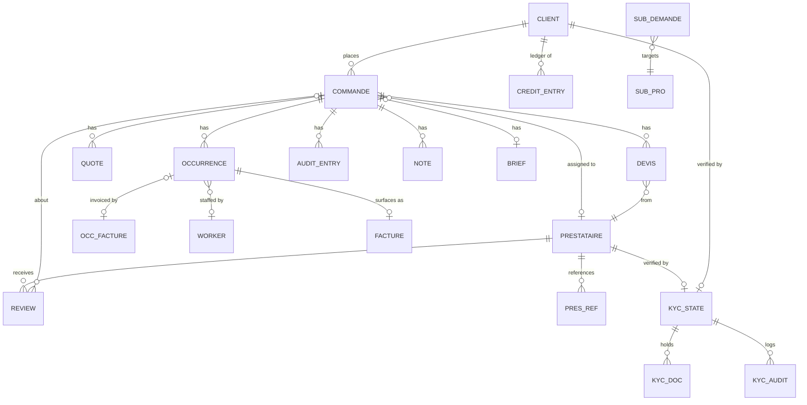

# De9De9 Admin — Database Schema

Data model for the De9De9 B2B services marketplace admin panel.

**Source of truth:** the Zod schemas in `src/features/*/schemas/*.ts`. The app currently runs
against an in-memory mock backend (`src/api/mock/`) seeded with the dataset below; this document
describes the same model as a **normalized relational schema** so it can back a real database
(PostgreSQL types shown). Where the mock stores nested JSON (e.g. a commande's occurrences), the
normalized form promotes it to its own table with a foreign key — those cases are called out.

- Conventions: `PK` primary key, `FK` foreign key, `→` references. All money is **credits**
  (integer `crédits`; the prestataire receives 85 %, de9de9 keeps 15 %). Human-facing dates are
  stored as `dd/mm/yyyy` strings in the mock; a real DB should use `date` / `timestamptz`
  (noted per column).
- Bilingual (FR/AR) display labels are **not** stored on entities — they live in the i18n
  dictionary (`src/lib/i18n/dict.ts`). Entities carry status **codes**; the UI resolves labels.

---

## Entity-relationship overview

> **Note on `CLIENT`:** the mock has no standalone clients table — a client is identified by its
> **name string** (`commande.client`, `credit_entry.client`, KYC key `client:<name>`). A production
> schema should introduce a `client` table with a surrogate `id` and repoint these FKs. This is the
> single biggest normalization gap and is flagged again on each affected table.

---

## Enumerated types

| Enum | Values | Used by |
|---|---|---|
| `setup_status` | `arappeler` (S1) · `contacte` (S2) · `devis` (S3) · `assigne` (S4) | `commande.setup` |
| `occ_status` | `added` (V0) · `toConfirm` (V1) · `confirmed` (V2) · `confirmedAssigned` (V3) · `doneNoInvoice` (V4) · `doneInvoiced` (V5) · `doneDisputed` (V5·C) · `doneApproved` (V6) · `paid` (V7) · `cancelled` (V✕) | `occurrence.status` |
| `ball` | `client` · `pro` · `de9` · `done` | derived (whose action is pending) |
| `audit_role` | `client` · `pro` · `de9` · `sys` | `audit_entry.role` |
| `devis_status` | `attente` · `recu` · `valide` · `refuse` | `devis.status` |
| `commande_type` | `recurrent` · `ponctuel` | `commande.type` |
| `devis_status` (quotes) | n/a — `quote.chosen boolean` | `quote` |
| `kyc_status` | `verified` · `pending` · `rejected` | `kyc_state.status` |
| `review_source` | `client` · `de9de9` | `review.source` |
| `credit_type` | `rech` (recharge) · `deb` (débit) · `vers` (versement) | `credit_entry.type` |
| `recharge_methode` | `Virement` · `Versement` · `Chèque` · `Carte` | recharge input |
| `facture_status` | `doneInvoiced` · `doneDisputed` · `doneApproved` · `paid` | `facture.status` |
| `analytics_kpi_key` | `vendus` · `depenses` · `verses` · `marge` · `circulation` | analytics KPI |

**Lifecycle — setup pipeline (S) then per-visit pipeline (V):**
`S1 à rappeler → S2 contacté → S3 devis → S4 assigné`, then each occurrence runs
`V0 ajoutée → V1 à confirmer → V2 confirmée → V3 confirmée+affectée → V4 réalisée (sans facture)
→ V5 facturée (V5·C contestée) → V6 approuvée → V7 payée`, or `V✕ annulée`.

---

## Tables

### `commande` — service orders
The central aggregate. Seeded: **9 rows** (`C-2041`, `C-2038`, `C-2035`, `C-2030`, `C-2024`, `C-2019`, `C-2012`, `C-2008`, `C-1990`).

| Column | Type | Constraints | Notes |
|---|---|---|---|
| `id` | `text` | **PK** | e.g. `C-2041` |
| `client` | `text` | not null | client name → see CLIENT note; FK target in prod |
| `contact` | `text` | not null | contact person |
| `phone` | `text` | not null | |
| `service` | `text` | not null | requested service label |
| `wilaya` | `text` | not null | Algerian province |
| `commune` | `text` | not null | |
| `client_email` | `text` | not null | |
| `type` | `commande_type` | not null | recurring vs one-off |
| `pattern` | `text` | | recurrence pattern (e.g. "Bi-mensuel") |
| `setup` | `setup_status` | not null | S-pipeline stage |
| `prestataire_name` | `text` | FK → `prestataire` (by name) / null | assigned provider snapshot (name+phone+email) |
| `sla_mins` | `integer` | not null | SLA budget in minutes |
| `proposed_to_client` | `boolean` | default false | devis batch transmitted to client |

Embedded in the mock as JSON, normalized here into child tables: **`occurrence`, `quote`, `devis`,
`audit_entry`, `note`, `brief`** (all FK → `commande.id`). The `prestataire` object
(`{ name, phone, email? }`) is a denormalized snapshot; keep it as columns or a small `commande_prestataire` row.

---

### `occurrence` — scheduled visits (child of `commande`)
One commande has 0..N occurrences (recurring orders have many; `C-1990` seeds 3).

| Column | Type | Constraints | Notes |
|---|---|---|---|
| `id` | `text` | **PK** (unique within commande) | e.g. `o1` |
| `commande_id` | `text` | **FK → commande.id**, not null | |
| `date` | `text`→`date` | not null | visit date (`dd/mm/yyyy` in mock) |
| `status` | `occ_status` | not null | V-pipeline stage |
| `worker_name` | `text` | FK → `worker` (by name) / null | assigned ouvrier |
| — facture (1:0..1) → | | | see `occ_facture` |

### `occ_facture` — invoice attached to an occurrence (1:0..1 with `occurrence`)
| Column | Type | Constraints | Notes |
|---|---|---|---|
| `occurrence_id` | `text` | **PK/FK → occurrence** | |
| `montant` | `integer` | not null | credits |
| `deposee` | `boolean` | not null | invoice uploaded |
| `transfere` | `boolean` | not null | provider paid out (85 %) |
| `file_name` | `text` | | |
| `note` | `text` | | |

---

### `quote` — quick candidate quotes (child of `commande`)
Legacy lightweight quote list used during setup.

| Column | Type | Constraints | Notes |
|---|---|---|---|
| `commande_id` | `text` | **FK → commande.id** | |
| `raison` | `text` | not null | provider/company name |
| `montant` | `integer` | not null | credits |
| `delai` | `text` | | lead time (e.g. "3 j") |
| `note` | `text` | | |
| `chosen` | `boolean` | not null | selected candidate |

### `devis` — detailed quote requests per prestataire (child of `commande`)
Present on commandes in the devis stage (e.g. `C-2035` seeds 3).

| Column | Type | Constraints | Notes |
|---|---|---|---|
| `commande_id` | `text` | **FK → commande.id** | |
| `pres_id` | `text` | **FK → prestataire.id** | |
| `raison` | `text` | not null | provider name |
| `phone` / `wa` / `email` | `text` | | contact channels |
| `status` | `devis_status` | not null | attente/recu/valide/refuse |
| `montant` | `integer` | not null | credits |
| `delai` | `text` | | |
| `details` | `text` | | |
| `doc_name` | `text` | | attached quote doc |
| `chosen` | `boolean` | nullable | |

---

### `brief` — detailed quote request (1:0..1 with `commande`)
| Column | Type | Constraints | Notes |
|---|---|---|---|
| `commande_id` | `text` | **PK/FK → commande** | |
| `ref` | `text` | not null | e.g. `BR-2035` |
| `service` | `text` | not null | |
| `description` | `text` | | |
| `budget_min` / `budget_max` | `integer` \| `text` | | free-text or numeric |
| `adresse` / `commune` / `wilaya` | `text` | | |
| `superficie` | `integer` \| `text` | | m² |
| `frequence` | `text` | | |
| `dates` | `text` | | |
| `contraintes` | `text` | | |
| `photos` | `jsonb` (`[{name}]`) | | attachment names |
| `docs` | `jsonb` (`[{name}]`) | | attachment names |
| `sent_at` | `text`→`timestamptz` | | |

---

### `audit_entry` — commande activity trail (child of `commande`)
Prepended on each mutation. Texts stored in **French** (locale-agnostic backend).

| Column | Type | Constraints | Notes |
|---|---|---|---|
| `commande_id` | `text` | **FK → commande.id** | |
| `txt` | `text` | not null | audit message |
| `role` | `audit_role` | not null | actor perspective |
| `date` | `text`→`timestamptz` | not null | |

### `note` — internal admin notes (child of `commande`)
| Column | Type | Constraints | Notes |
|---|---|---|---|
| `commande_id` | `text` | **FK → commande.id** | |
| `author` | `text` | not null | |
| `text` | `text` | not null, min 1 | |
| `date` | `text`→`timestamptz` | not null | |
| `handled` | `boolean` | not null | resolved flag |

---

### `prestataire` — service providers
Seeded: **24 rows** (`p1`..`p24`).

| Column | Type | Constraints | Notes |
|---|---|---|---|
| `id` | `text` | **PK** | e.g. `p1` |
| `name` | `text` | not null | |
| `init` | `text` | | avatar initials |
| `cat` | `integer` | not null | taxonomy category id (1..16) |
| `subs` | `text[]` | | sub-service labels |
| `wilayas` | `text[]` | | coverage zones |
| `rating` | `numeric` | | avg rating |
| `reviews` | `integer` | | review count (denormalized) |
| `missions` | `integer` | | completed missions |
| `sat` | `integer` | | satisfaction % |
| `delai` | `text` | | typical lead time |
| `effectif` | `integer` | | headcount |
| `certs` | `text[]` | | certifications |
| `kyc` | `boolean` | | KYC verified flag (see `kyc_state`) |
| `tarif` | `integer` | | price band 1..3 |
| `anc` | `integer` | | years active |
| `langues` | `text[]` | | languages |
| `phone` / `wa` / `email` | `text` | | |
| `dispo` | `text` | | `now` or `dd/mm/yyyy · hh:mm` |

### `pres_ref` — provider client references (child of `prestataire`)
| Column | Type | Constraints |
|---|---|---|
| `pres_id` | `text` | **FK → prestataire.id** |
| `client` | `text` | not null |
| `service` | `text` | not null |

### `worker` — de9de9 field workers (ouvriers)
Seeded as a **string list**: `Karim B.`, `Sofiane M.`, `Yacine T.`, `Nadia R.`
In prod: `worker(id PK, name)`; `occurrence.worker_name` → FK.

---

### `kyc_state` — KYC dossier (polymorphic: prestataire **or** client)
Keyed in the mock by a composite string: `pres:<presId>` or `client:<clientName>`.
Seeded keys: `pres:p1`, `pres:p2`, `client:Clinique El Wifaq`, `client:Usine Métalux`.

| Column | Type | Constraints | Notes |
|---|---|---|---|
| `key` | `text` | **PK** | `pres:<id>` or `client:<name>` |
| `subject_type` | `text` | | `pres` \| `client` (split from key) |
| `subject_id` | `text` | FK → prestataire.id / client | |
| `status` | `kyc_status` | not null | verified/pending/rejected |
| `motif` | `text` | | reason (esp. when rejected) |

### `kyc_doc` — KYC documents (child of `kyc_state`)
| Column | Type | Constraints |
|---|---|---|
| `id` | `text` | **PK** |
| `kyc_key` | `text` | **FK → kyc_state.key** |
| `label` | `text` | not null |
| `name` | `text` | not null (file name) |

### `kyc_audit` — KYC journal (child of `kyc_state`)
| Column | Type | Constraints |
|---|---|---|
| `kyc_key` | `text` | **FK → kyc_state.key** |
| `who` | `text` | not null |
| `action` | `text` | not null |
| `date` | `text`→`timestamptz` | not null |

---

### `review` — provider reviews
Seeded: **20 rows** (`r1`..`r20`).

| Column | Type | Constraints | Notes |
|---|---|---|---|
| `id` | `text` | **PK** | e.g. `r1` |
| `pres_id` | `text` | **FK → prestataire.id**, not null | |
| `source` | `review_source` | not null | client vs de9de9 |
| `auteur` | `text` | not null | author label |
| `cmd` | `text` | FK → commande.id / '' | linked order |
| `occ` | `text` | | occurrence id / '' |
| `service` | `text` | | |
| `note` | `integer` | not null, 1..5 | star rating |
| `comment` | `text` | not null | |
| `date` | `text`→`date` | not null | |

---

### `credit_entry` — client credits ledger
Seeded: **9 rows**. Recharge rows (`REC-8830`, `REC-8815`) carry payment pieces.

| Column | Type | Constraints | Notes |
|---|---|---|---|
| `id` (implicit) | `serial` | **PK** | mock has no explicit id; use `ref`+`date` or a surrogate |
| `date` | `text`→`date` | not null | |
| `type` | `credit_type` | not null | rech/deb/vers |
| `client` | `text` | not null | → CLIENT note |
| `benef` | `text` | | beneficiary, `—` when none |
| `ref` | `text` | not null | `REC-####` / `F-####` / `V-####` |
| `credits` | `integer` | not null | **signed** amount |
| `solde` | `text` | | running balance (`—` when n/a) |
| `email` / `phone` | `text` | | |
| `cmd_ref` | `text` | FK → commande.id / '' | linked order |
| `justif` | `jsonb` (`{name}`) | nullable | recharge: client payment proof |
| `facture` | `jsonb` (`{name}`) | nullable | recharge: de9de9 invoice |

---

### `facture` — invoices (derived view over occurrences)
**Not a base table** in the mock — recomputed from every occurrence that has a deposited
`occ_facture` (`facturesFromCommandes`). Materialize as a view or a projection. Composite key
`(cmd_id, occ_id)`. Seeded surface: **5 rows**.

| Column | Type | Constraints | Notes |
|---|---|---|---|
| `cmd_id` | `text` | **FK → commande.id** | part of PK |
| `occ_id` | `text` | **FK → occurrence.id** | part of PK |
| `ref` | `text` | | `F-` + digits of commande id |
| `montant` | `integer` | | credits (85 % provider / 15 % de9de9) |
| `date` | `text`→`date` | | visit date |
| `status` | `facture_status` | | invoiced/disputed/approved/paid |
| `transfere` | `boolean` | | provider paid out |
| `client` / `contact` / `email` | `text` | | snapshot from commande |
| `pres` | `text` | | provider name or `—` |
| `service` | `text` | | |

---

### `sub_demande` — subcontracting requests
Seeded: **5 rows** (`ST-101`..`ST-105`).

| Column | Type | Constraints | Notes |
|---|---|---|---|
| `id` | `text` | **PK** | e.g. `ST-101` |
| `entreprise` | `text` | not null | requesting company |
| `cat` | `text` | | category |
| `sub` | `text` | | sub-service |
| `date` | `text`→`date` | not null | |

### `sub_pro` — accredited subcontractors
Seeded: **10 rows** (`st1`..`st10`).

| Column | Type | Constraints | Notes |
|---|---|---|---|
| `id` | `text` | **PK** | e.g. `st1` |
| `name` | `text` | not null | |
| `wilaya` / `commune` | `text` | | |
| `cat` | `text` | | |
| `services` | `text` | | |
| `realises` / `recues` / `envoyees` | `integer` | | mission counters |
| `abandon` | `integer` | | abandon rate % |
| `dispo` | `text` | | `now` or `dd/mm` |
| `phone` / `wa` | `text` | | |

### `sub_audit` — "déclarer salarié" journal
| Column | Type | Constraints |
|---|---|---|
| `pro` | `text` | not null (→ sub_pro.name) |
| `entreprise` | `text` | not null |
| `who` | `text` | not null |
| `date` | `text`→`timestamptz` | not null |

---

### `handicap_worker` — disability-hiring waitlist (confidential, admin-only)
Seeded: **5 rows** (`hc1`..`hc5`). No medical data is collected.

| Column | Type | Constraints | Notes |
|---|---|---|---|
| `id` | `text` | **PK** | e.g. `hc1` |
| `entreprise` | `text` | not null | employer |
| `contact` | `text` | | |
| `phone` / `wa` | `text` | | |
| `poste` | `text` | | role offered |
| `nombre` | `integer` | | headcount wanted |
| `zone` | `text` | | wilaya |
| `date` | `text`→`date` | | registration date |
| `commentaire` | `text` | | |
| `contacted` | `boolean` | not null | outreach done |

---

### Analytics (aggregate / read model — not stored)
`GET /analytics` returns a computed `AnalyticsData` object, not a table:

- `kpis[]` — `{ key: analytics_kpi_key, value, delta, positive }`
- `chart_bars[]` — `{ label, vendus, depenses, verses }` (monthly % heights)
- `top_clients[]` / `top_prestataires[]` — `{ init, name, value, color }`

In production these derive from `commande` / `occ_facture` / `credit_entry` aggregations.

---

## API surface (mock routes → tables)

| Method | Path | Reads / writes |
|---|---|---|
| GET | `/commandes` | `commande` (+children) |
| GET | `/commandes/:id` | `commande` |
| POST | `/commandes/:id/actions` | `occurrence`, `occ_facture`, `commande.setup`, `audit_entry` |
| POST | `/commandes/:id/devis` | `devis`, `commande.proposed_to_client`, `audit_entry` |
| POST | `/commandes/:id/notes` | `note` |
| POST | `/commandes/:id/notes/:index/handled` | `note.handled` |
| GET | `/prestataires` · `/prestataires/:id` | `prestataire` (+`pres_ref`) |
| GET | `/reviews?presId=` · POST `/reviews` | `review` |
| GET | `/credits` · POST `/recharges` | `credit_entry` |
| GET | `/factures` | `facture` (derived) |
| GET | `/sub/demandes` · `/sub/pros` · POST `/sub/salaries` | `sub_demande`, `sub_pro`, `sub_audit` |
| GET | `/handicap` | `handicap_worker` |
| GET | `/analytics` | aggregate read model |
| GET | `/kyc/:key` · POST `/kyc/:key/docs` · DELETE `/kyc/:key/docs/:docId` | `kyc_state`, `kyc_doc`, `kyc_audit` |

---

## Production migration notes
1. **Introduce a `client` table** (surrogate `id`, `name`, `email`, `phone`) and repoint
   `commande.client`, `credit_entry.client`, and the `client:` KYC keys to it — the model currently
   joins clients by name string.
2. **Promote embedded arrays** (`occurrence`, `quote`, `devis`, `audit_entry`, `note`, `brief`,
   `pres_ref`, `kyc_doc`, `kyc_audit`) to child tables with `commande_id` / `pres_id` / `kyc_key` FKs
   as laid out above (or keep as `jsonb` columns for a document store).
3. **Dates & money:** convert `dd/mm/yyyy` strings to `date`/`timestamptz`; keep credits as `integer`.
4. **`facture` is a view** over invoiced occurrences — materialize or compute on read.
5. **KYC is polymorphic** — either split into `prestataire_kyc` / `client_kyc`, or keep the
   `(subject_type, subject_id)` pair with a partial-unique constraint.
