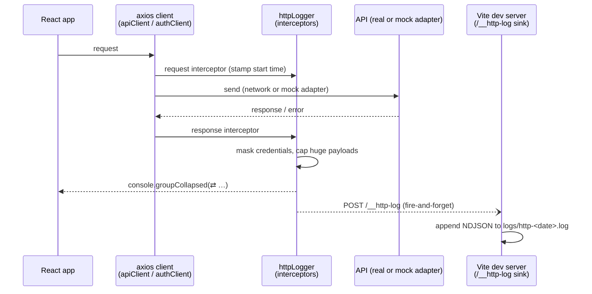

# De9De9 Admin — HTTP Logging

Every request made by the app's two axios clients — `apiClient` (business API) and
`authClient` (login / token refresh) — is logged twice in development:

1. **Browser console** — one collapsed group per request (endpoint, status, duration,
   headers, params/body, response).
2. **Log file on disk** — the same entry is appended as NDJSON to
   `logs/http-<yyyy-mm-dd>.log` in the project root.

Credentials never reach either destination: any key matching
`password | token | secret | authorization` is masked to `***` recursively — in request
headers, request bodies **and** response payloads (so the login response's
`accessToken` / `refreshToken` are never written anywhere).

**Source of truth:** `src/api/httpLogger.ts` (the logger) and the `http-log-sink`
plugin in `vite.config.ts` (the file writer).

---

## How it works



Key properties:

- **Mock-served requests are logged too.** The interceptors wrap the axios adapter,
  so exchanges answered by `src/api/mock/` (which never touch the network and are
  therefore invisible in the DevTools *Network* tab) still appear in both sinks.
- **Interceptor ordering is deliberate.** `attachHttpLogger()` is called right after
  `axios.create`, *before* the auth interceptors are registered on `apiClient`. Its
  response interceptor therefore runs first: a `401` is logged **as received**, and
  the token-refresh retry that follows is logged as its own request — the whole
  refresh dance is visible in sequence.
- **Logging can never break the app.** The file-sink `fetch` is fire-and-forget and
  every failure path is swallowed. If the sink is absent (tests, `vite preview`,
  production), console logging still works and the POST silently no-ops.
- **Huge payloads are capped** at 20 000 serialized characters per field in the
  *file* (replaced by `{ truncated: true, chars, preview }`) so the log stays
  greppable. The console shows the full object.

## Where the pieces live

| Piece | File | Role |
| --- | --- | --- |
| Logger + masking | `src/api/httpLogger.ts` | Interceptors, console output, file-sink POST |
| Attach to business client | `src/api/apiClient.ts` | `attachHttpLogger(apiClient)` before auth interceptors |
| Attach to auth client | `src/features/auth/api/auth.ts` | `attachHttpLogger(authClient)` |
| File sink | `vite.config.ts` → `httpLogSink()` | `POST /__http-log` middleware, appends NDJSON |
| Output | `logs/http-<date>.log` | One JSON object per line; gitignored |

## Configuration

Controlled by `VITE_HTTP_LOG` (see `.env.example`):

| Mode | Console | File |
| --- | --- | --- |
| dev, unset (default) | ✅ on | ✅ on |
| dev, `VITE_HTTP_LOG=false` | ❌ off | ❌ off |
| production build, unset | ❌ off | ❌ (no sink) |
| production build, `VITE_HTTP_LOG=true` | ✅ on | ❌ (no sink) |

The file sink exists **only on the Vite dev server** — a production build has no
`/__http-log` endpoint, so forcing the logger on in production yields console output
only. Restart the dev server after changing the flag.

## Log entry format

One JSON object per line (NDJSON). Fields marked *opt.* are present only when the
request/response carried them.

```jsonc
{
  "ts": "2026-09-01T14:52:03.114Z",   // when the response arrived
  "method": "GET",
  "url": "/api/commandes/worklist?page=1&pageSize=20",
  "status": 200,                       // number, or "network error"
  "durationMs": 134,
  "headers": { "Accept": "…", "Authorization": "***" },
  "params": { "period": "mois" },      // opt. — axios `params`
  "body": { "kind": "callClient", "password": "***" }, // opt. — request body
  "response": { "meta": {}, "data": [] },   // opt. — success payload (capped)
  "error": { "message": "Commande introuvable : NOPE" } // opt. — error payload
}
```

## Reading the logs

```bash
tail -f logs/http-$(date +%F).log                          # watch live
cat logs/http-*.log | jq                                   # pretty-print everything
jq 'select(.status >= 400 or .status == "network error")' logs/http-*.log   # failures only
jq 'select(.url | contains("worklist"))' logs/http-*.log   # one endpoint
jq -r '[.ts, .method, .url, .status, .durationMs] | @tsv' logs/http-*.log   # compact table
jq 'select(.durationMs > 1000)' logs/http-*.log            # slow requests
```

In the browser console, type `⇄` in the DevTools filter box to show only HTTP log
groups. Green header = 2xx/3xx, red = 4xx/5xx/network error.

## Limitations & notes

- One file per calendar day, named at dev-server start — a server left running past
  midnight keeps writing to the previous day's file until restarted.
- Entries are appended in **response arrival order**, which with parallel requests is
  not necessarily launch order (use `ts` + `durationMs` to reconstruct).
- The sink trusts the dev machine: `/__http-log` accepts any POST body. It is a
  dev-only middleware and is never part of a build.
- `logs/` and `*.log` are gitignored — log files never land in commits. They may
  still contain business data (client names, amounts); treat them like any local
  data dump when sharing.
